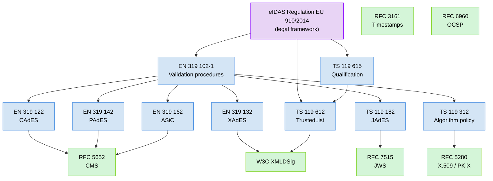
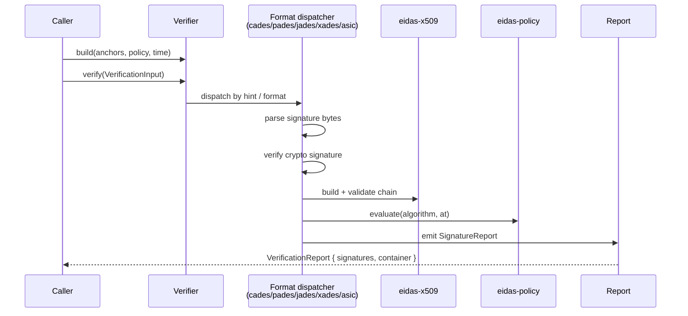

# Overview

## What this library does

`eidas-verify` verifies electronic signatures produced under the EU's eIDAS
regulation (EU 910/2014 and successors). You hand it signed bytes and trust
material; it tells you whether the signature is cryptographically sound,
what **level** (B-B / B-T / B-LT / B-LTA) it reaches, and — when a
TrustedList is supplied — what **qualification** it has (AdES, AdES-QC,
QES).

## What this library deliberately does not do

### No network I/O, ever.
Trust-list download, OCSP fetch, CRL download, and TSA request are the
caller's responsibility. The library verifies bytes you hand it.

### No signing.
This is a one-way crate. For signing, see EU DSS or format-specific Rust
libraries.

### No GUI, no document rendering.
PAdES verification extracts `/ByteRange` and `/Contents`. It does not parse
the page tree, render visible signatures, or validate anything outside the
CMS blob.

## The standards stack

## Coverage matrix

### Formats

| Standard | Library crate | B-B | B-T | B-LT | B-LTA |
|----------|---------------|-----|-----|------|-------|
| CAdES — EN 319 122 | `eidas-cades` | ✓ | ✓ | ✓ | ⚠ (chain verified, archive imprint deferred) |
| PAdES — EN 319 142 | `eidas-pades` → `eidas-cades` | ✓ | ✓ | ✓ | ⚠ |
| ASiC-S / ASiC-E — EN 319 162 | `eidas-asic` → `eidas-cades` | ✓ | ✓ | ✓ | ⚠ |
| JAdES — TS 119 182 | `eidas-jades` | ✓ | ⚠ (parsed, not lifted) | — | — |
| XAdES — EN 319 132 | `eidas-xades` (feature `xades`) | ✓ narrow profile | — | — | — |

### Building blocks

| Standard | Library crate | Status |
|----------|---------------|--------|
| X.509 path validation — RFC 5280 | `eidas-x509` | Core subset (AKI/SKI, validity, CA capability, keyCertSign); no policy/name constraints |
| CMS SignedData — RFC 5652 | `eidas-cms` | Parse + verify signedAttrs, signing-certificate-v2, message-digest |
| RFC 3161 timestamps | `eidas-timestamp` | Full (TSA chain, imprint, `id-kp-timeStamping` EKU) |
| OCSP — RFC 6960 | `eidas-revocation` | Offline verify (signature, responder delegation, time windows) |
| CRL — RFC 5280 §5 | `eidas-revocation` | Offline verify (signature, `cRLSign` keyUsage, time windows) |
| TS 119 312 algorithm policy | `eidas-policy` | `etsi_119_312_2023()` — versioned |
| TS 119 612 TrustedList | `eidas-trust` | Parse only; TSL XMLDSig verification deferred |
| TS 119 615 qualification | `eidas-qualify` | AdES / AdES-QC / QES decision with qualifier handling |

## Where coverage is incomplete

- **B-LTA archive-timestamp imprint** over canonical CAdES bytes
  (EN 319 122-1 §5.5.3). TSA signature and chain verify; the imprint
  comparison yields an `ATS_IMPRINT_NOT_VERIFIED` warning.
- **JAdES B-T / B-LT / B-LTA** — `sigTst`/`xRefs`/`arcTst` headers parsed,
  not yet rolled into the level cascade.
- **XAdES outside the narrow profile** — anything with ds:XPath, XSLT,
  DTDs, or non-exc-c14n canonicalisation is rejected with an explicit
  diagnostic.
- **TSL XMLDSig signature verification** — structural parse works; the
  TSL's own signature is not verified. Callers must validate TSL integrity
  out of band. This lands with a future libxml2/xmlsec1 backend.
- **Online revocation** — intentional. Callers fetch and hand in bytes.

## Shape of a verification

The rest of this folder drills into each of those boxes.
