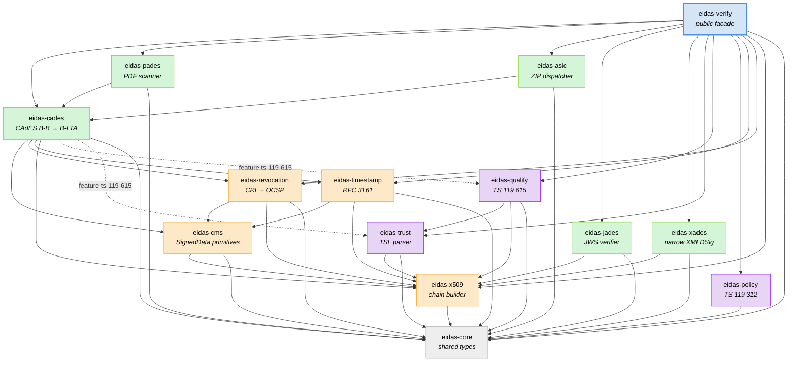
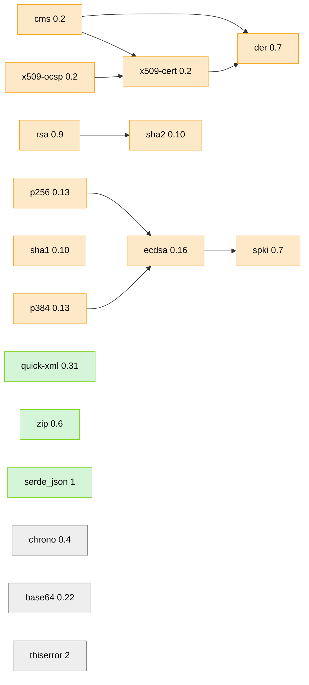
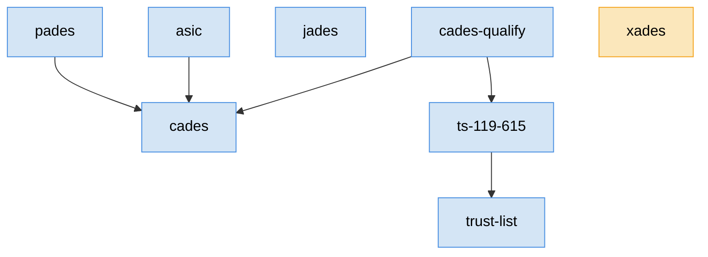

# Architecture

## Crate layout

The workspace is 14 crates. One is the public facade; eight are
format-specific engines or standards implementations; five are shared
primitives.



**Read the graph top-down:** every arrow is a direct Rust dep. The
facade depends on everything; format crates depend on primitives;
primitives depend on `eidas-core`. There are no dependency cycles —
`eidas-cms` never imports `eidas-revocation` or `eidas-cades`, so the
stack can be compiled and tested in strict layers.

## Layer responsibilities

### Layer 1 — `eidas-core`

The glue layer. Contains **only** types:

- `ValidationTime` — reference-time variants (`Now`, `At`, `BestSignatureTime`).
- `AlgorithmId`, `AlgorithmPolicy`, `HashAlgorithm`, `SignatureAlgorithm`.
- `Error` enum + `Result<T>` alias.
- `VerificationReport`, `SignatureReport`, `Status`, `Level`,
  `Qualification`, `QualificationQualifier`.
- `DiagnosticMessage`, `DiagnosticSeverity`.
- `CertificateInfo`, `TimestampInfo`, `RevocationInfo`, `ContainerInfo`.

No crypto, no parsing. Keeping it pure means every crate above can depend
on it without transitively pulling in XML, PDF, or CMS code.

### Layer 2 — primitive parsers and verifiers

- **`eidas-x509`** — X.509 chain construction. AKI/SKI matching, DN
  fallback, validity-window enforcement, `basicConstraints.cA` +
  `keyCertSign` check, depth guard. No revocation (that's layer 2a).
- **`eidas-policy`** — ETSI TS 119 312 algorithm tables. Function
  `etsi_119_312_2023()` returns a populated `AlgorithmPolicy`.
- **`eidas-cms`** — everything CMS-specific:
  - `oids.rs` — OID constants.
  - `envelope.rs` — `ContentInfo → SignedData` parse + content resolver.
  - `attrs.rs` — signed-attribute helpers (`find`, `message_digest`,
    `content_type`, `signing_time`, `to_signed_der`).
  - `digest.rs` — hash dispatch (SHA-1 through SHA-512, plus SHA-3 stubs).
  - `signature_verify.rs` — algorithm-OID → RustCrypto verifier dispatch
    (RSA PKCS#1v1.5, ECDSA P-256/P-384 DER).
  - `cades.rs` — the Phase 2 B-B verifier (kept in place; extended by
    `eidas-cades`).

### Layer 2a — format-adjacent primitives

Built on layer 2 but themselves not full format verifiers:

- **`eidas-revocation`** — CRL + OCSP verification. Reuses
  `eidas-cms::signature_verify::verify_cms_signature` for the actual
  crypto.
- **`eidas-timestamp`** — RFC 3161 TST parsing + verification, likewise
  reusing `eidas-cms`.
- **`eidas-trust`** — TS 119 612 TSL parsing into typed structs.

### Layer 3 — format orchestrators

These compose layer 2/2a to produce a final `SignatureReport`:

- **`eidas-cades`** — top-level CAdES with unsigned-attribute processing
  (signature-time-stamp, ets-revocationValues, archive-timestamp-v3).
  This is the layer that walks the B-B → B-LTA cascade.
- **`eidas-pades`** — scans PDF for `/ByteRange`/`/Contents`, dispatches
  each signature into `eidas-cades` as a detached CAdES.
- **`eidas-asic`** — parses the ASiC ZIP, pairs each `META-INF/*.p7s`
  with each data entry, dispatches into `eidas-cades`.
- **`eidas-jades`** — self-contained JWS verifier (no dependency on CMS).
- **`eidas-xades`** — self-contained narrow XMLDSig verifier.

### Layer 4 — qualification

- **`eidas-qualify`** — consumes a validated chain + `TrustedLists` + the
  signer cert's `qcStatements` and returns a final `Qualification`.
  Re-invoked from `eidas-cades` when the `ts-119-615` feature is on.

### Layer 5 — facade

- **`eidas-verify`** — `Verifier` + `VerifierBuilder`, format dispatch
  via `VerificationInput` + `ContainerHint` / `DetachedFormat`. Re-exports
  every sub-crate as a module so advanced callers can skip the facade.

## Workspace dependency resolution

Every crate shares a single `[workspace.dependencies]` block in the root
`Cargo.toml` so version drift can't happen. RustCrypto versions are pinned
to the stable `0.2`/`0.7` line rather than the in-flight `0.3`/`0.8`
release candidates, because stability here matters more than being on the
bleeding edge.



## Feature-flag topology



`default = ["cades", "pades", "asic", "jades", "trust-list", "ts-119-615", "cades-qualify"]`.

`xades` stays opt-in: the plan earmarked XAdES for libxml2/xmlsec1 FFI,
and while the crate currently ships a pure-Rust *narrow* profile instead,
the opt-in boundary is kept so callers who don't need XMLDSig-family
signatures don't pull in a ~3 kLoC XML verifier.

## Directory structure

```
eidas-verify/
├── Cargo.toml                                  workspace root
├── README.md                                   user-facing quick start
├── docs/                                       this folder
├── plans/serialized-roaming-tiger.md           full roadmap
└── crates/
    ├── eidas-verify/                           facade
    │   ├── src/lib.rs, verifier.rs
    │   └── examples/verify.rs                  CLI demo
    │
    ├── eidas-core/                             shared types
    │   └── src/{lib,error,algorithm,report,time}.rs
    │
    ├── eidas-policy/                           TS 119 312 tables
    ├── eidas-x509/                             chain builder
    │
    ├── eidas-cms/                              CMS primitives
    │   └── src/{oids,envelope,attrs,digest,signature_verify,cades}.rs
    │
    ├── eidas-revocation/src/{crl,ocsp}.rs      CRL + OCSP
    ├── eidas-timestamp/src/tst.rs              RFC 3161
    │
    ├── eidas-cades/                            CAdES levels
    │   └── src/{unsigned,verify}.rs
    │
    ├── eidas-pades/                            PDF
    │   └── src/{scan,verify}.rs
    │
    ├── eidas-asic/                             ZIP container
    ├── eidas-jades/                            JWS
    │   └── src/{jws,verify}.rs
    │
    ├── eidas-xades/                            XMLDSig narrow
    │   └── src/{c14n,parse,verify}.rs
    │
    ├── eidas-trust/                            TS 119 612
    │   └── src/{model,parse,qualify}.rs
    │
    └── eidas-qualify/                          TS 119 615
        └── src/{qcstatements,engine}.rs
```
