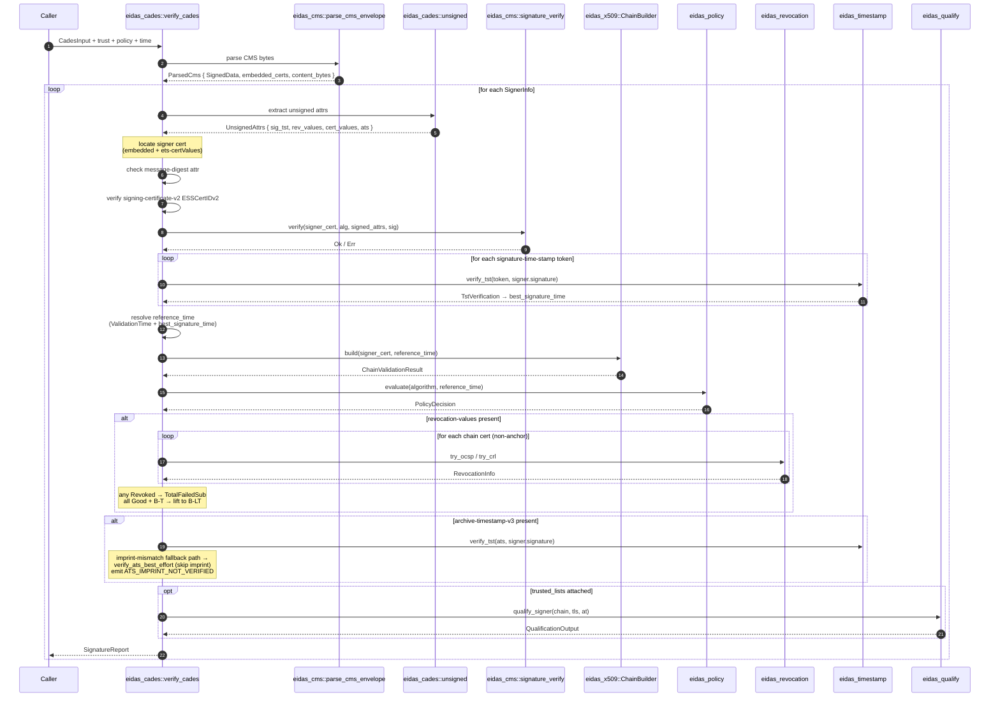
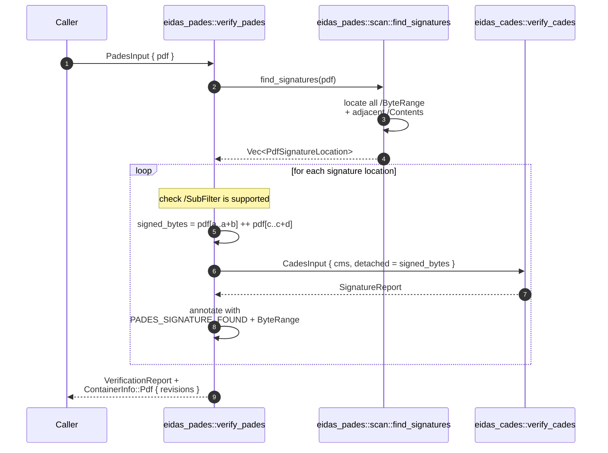
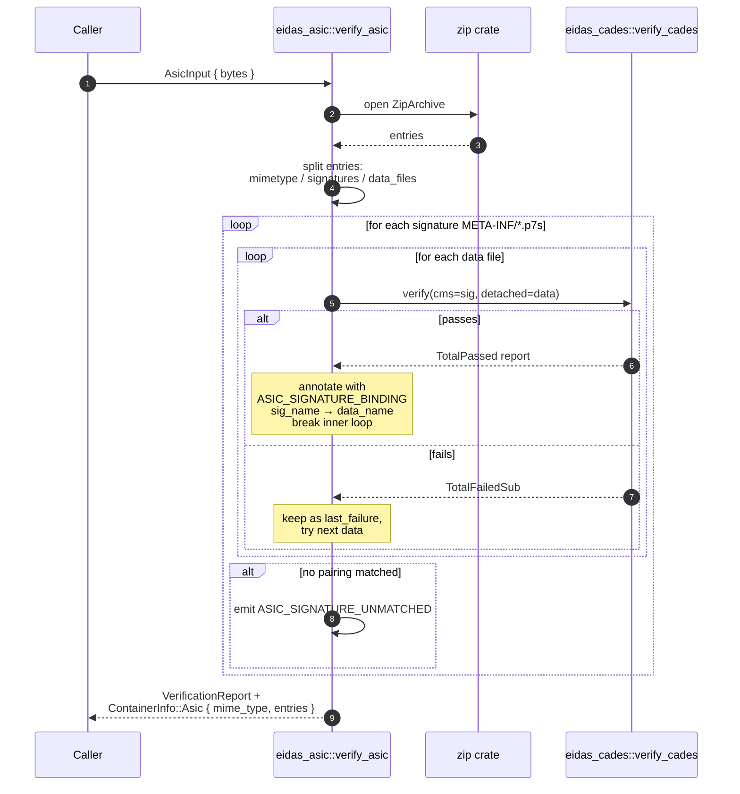
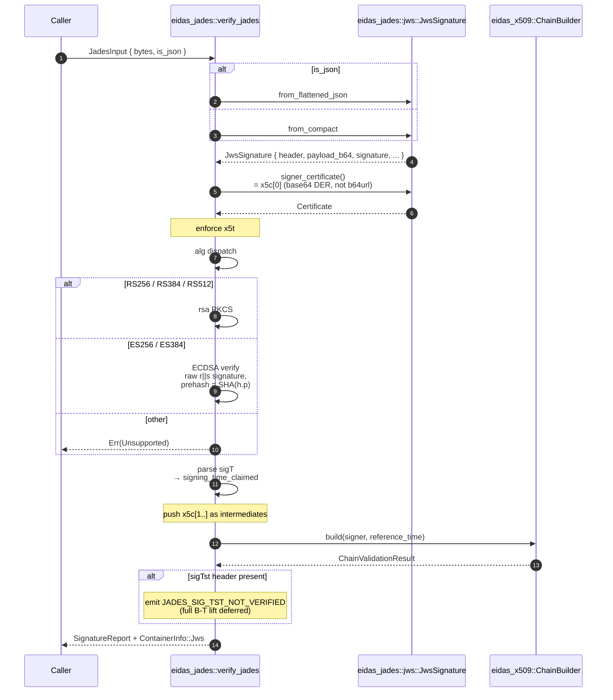
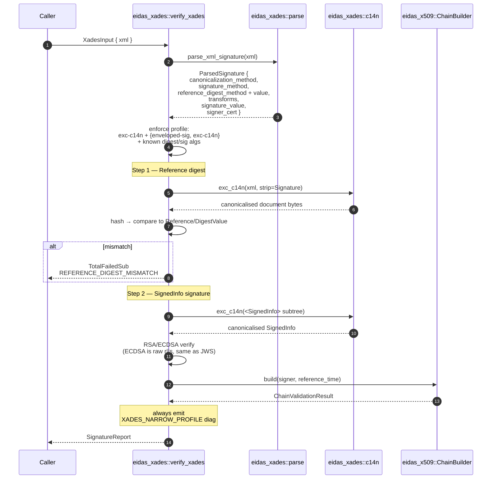

# Data flow

End-to-end sequence diagrams showing exactly which type crosses which
boundary during a `Verifier::verify()` call. One section per format.

## Common prelude: `Verifier::verify()` dispatch

Every call enters at the facade and is routed by
`VerificationInput` + `ContainerHint`/`DetachedFormat` (`crates/eidas-verify/src/verifier.rs`):

```mermaid
flowchart TB
    start(["verify(input)"]) --> match{match input}

    match -- "Detached { Cades }" --> cades[eidas_cades::verify_cades]
    match -- "Container { None }" --> cades
    match -- "Container { Pdf }" --> pades[eidas_pades::verify_pades]
    match -- "Container { Asic }" --> asic[eidas_asic::verify_asic]
    match -- "Container { JadesCompact }" --> jades_c[eidas_jades::verify_jades<br/>is_json=false]
    match -- "Container { JadesJson }" --> jades_j[eidas_jades::verify_jades<br/>is_json=true]
    match -- "Container { XadesEnveloped }" --> xades[eidas_xades::verify_xades]

    match -- otherwise --> err[Err(Unsupported)]

    cades --> report[VerificationReport]
    pades --> report
    asic --> report
    jades_c --> report
    jades_j --> report
    xades --> report
```

The trust material passed to each engine is reconstructed on every call
via `cades_trust_material()`, which snapshots the anchors and
intermediates cached on the `Verifier`.

## CAdES

Attached **or** detached. Detached adds `detached_content: Some(bytes)`
at the top of the flow; attached gets it from `SignedData.encap_content_info.eContent`.



Key files:
- `crates/eidas-cades/src/verify.rs` — the orchestrator.
- `crates/eidas-cades/src/unsigned.rs` — unsigned-attr parsing.
- `crates/eidas-cms/src/envelope.rs` — shared CMS envelope parse.

## PAdES

PAdES is "detached CAdES inside a PDF". The PDF layer is a byte-range
scanner; every signature it finds is fanned out to CAdES.



PAdES accepts `/SubFilter` values `adbe.pkcs7.detached`,
`ETSI.CAdES.detached`, `ETSI.RFC3161`. Unknown SubFilters yield a
`PADES_UNSUPPORTED_SUB_FILTER` failure report rather than an `Err`.

Key files:
- `crates/eidas-pades/src/scan.rs` — byte-level `/ByteRange` / `/Contents` scanner.
- `crates/eidas-pades/src/verify.rs` — dispatch.

## ASiC

ASiC unpacks a ZIP. Each signature under `META-INF/` is paired with each
top-level data file until one pairing verifies. No manifest parsing yet
(the brute-force pairing correctly handles the common single-signature-per-document case).



Key file: `crates/eidas-asic/src/verify.rs`.

## JAdES

JWS — RFC 7515 — with ETSI-specific headers. Self-contained: `eidas-jades`
does its own parsing and crypto without going through `eidas-cms`.



**Critical note on signature format:** JWS ECDSA signatures are **raw
r||s** (RFC 7518 §3.4), unlike CAdES's DER-encoded r+s. Crossing the
streams is a common integration bug; `eidas-jades::verify::ecdsa_verify_p256`
uses `p256::ecdsa::Signature::try_from(raw_bytes)` rather than
`::from_der`.

Key files:
- `crates/eidas-jades/src/jws.rs` — parse + header typing.
- `crates/eidas-jades/src/verify.rs` — crypto + chain.

## XAdES (narrow profile, opt-in)

Enveloped XMLDSig only. Canonicalisation method must be Exclusive C14N 1.0.



Key files:
- `crates/eidas-xades/src/parse.rs` — quick-xml event-driven walk of
  `<ds:Signature>`.
- `crates/eidas-xades/src/c14n.rs` — Exclusive C14N 1.0 narrow subset
  (attribute sorting, enveloped-signature strip, escape rules).
- `crates/eidas-xades/src/verify.rs` — orchestration + crypto.

## Crypto signature verification (shared)

All format crates reduce down to one of these primitives:

```mermaid
flowchart LR
    classDef shared fill:#fde9c8,stroke:#f5a623

    style cms fill:#fff

    subgraph cms [eidas_cms::signature_verify]
      vv[verify_cms_signature<br/>(cert, sig_alg, digest_hint, data, sig)]:::shared
      resolve[resolve_sig_alg]
      rsa[rsa_pkcs1v15_verify]
      p256[ecdsa_p256_verify]
      p384[ecdsa_p384_verify]
      vv --> resolve
      resolve --> rsa
      resolve --> p256
      resolve --> p384
    end

    jades_rsa[eidas_jades::verify::rsa_verify] --> rsa
    jades_p256[eidas_jades::verify::ecdsa_verify_p256] -.->|JWS raw r#124;#124;s| p256
    xades_rsa[eidas_xades::verify::rsa_verify] --> rsa
    xades_p256[eidas_xades::verify::ecdsa_p256_verify] -.->|XMLDSig raw r#124;#124;s| p256
```

CAdES signatures come in as DER-encoded ECDSA (`p256::ecdsa::Signature::from_der`).
JAdES and XAdES come in as raw r||s (`Signature::try_from(&[u8])`).
The format crates pick the right decoder; the primitive itself doesn't
know which encoding is in play.
