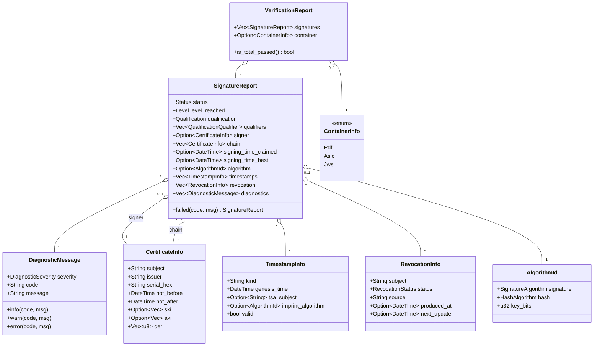
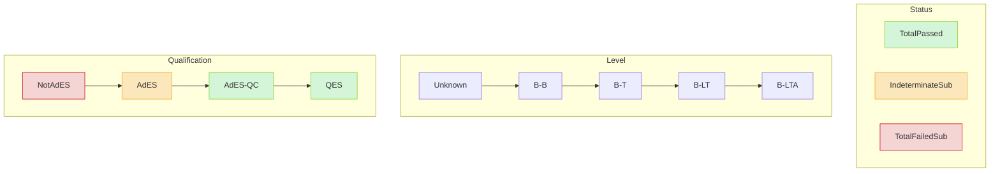
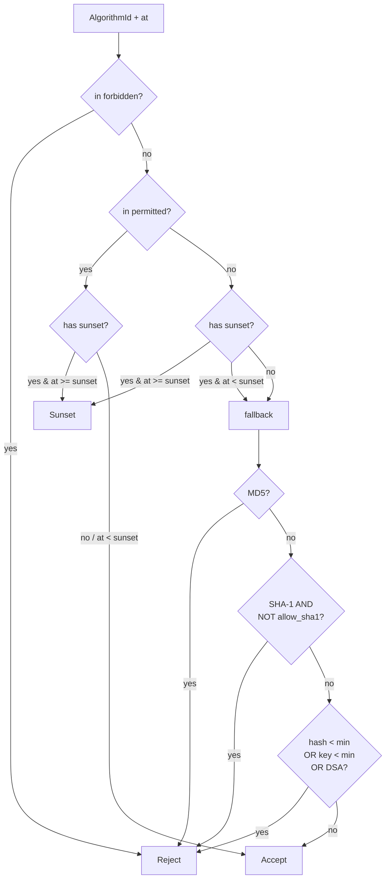
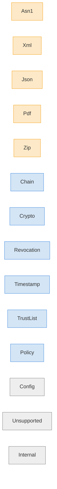

# Type model

All public data types live in `eidas-core` and are re-exported verbatim
from the `eidas-verify` facade. This document lists them, shows their
relationships, and names the populate-sites.

## Top-level relationships



## The status / level / qualification axes

Three orthogonal dimensions combine to describe a signature:



- **`Status`** answers: did verification succeed? From EN 319 102-1.
- **`Level`** answers: what B-level did the artefact reach? Strictly
  monotonic — B-LTA implies B-LT implies B-T implies B-B.
- **`Qualification`** answers: is this a qualified electronic signature
  under eIDAS Article 3? Requires a TrustedList; without one, every
  signature tops out at `AdES`.

A typical `TotalPassed + BLT + QES` is a signature that met every check,
carries a trustworthy timestamp + revocation proof, and was made with a
qualified certificate backed by a QSCD.

## `ValidationTime` — the reference-time model

All of { chain validation, revocation freshness, algorithm policy } are
time-sensitive. `ValidationTime` picks which instant they evaluate at.

```mermaid
stateDiagram-v2
    [*] --> Now
    [*] --> At
    [*] --> BestSignatureTime

    Now: ValidationTime::Now
    Now: resolve() = system clock

    At: ValidationTime::At(DateTime#lt;Utc#gt;)
    At: resolve() = caller-supplied instant

    BestSignatureTime: ValidationTime::BestSignatureTime
    BestSignatureTime: resolve() = latest trustworthy TST,<br/>fallback = Utc::now()
```

`BestSignatureTime` is the ETSI-correct default for historical validation
of long-term signatures: the signer's cert may have expired years ago,
but a signature-timestamp grounded at production time lets us evaluate
the chain as it was *then*.

## `AlgorithmPolicy` — the policy engine

`AlgorithmPolicy` is effectively `{permitted, forbidden, sunsets,
fallback minimums}`. Evaluation is:



Concrete policies live in `eidas-policy` —
`etsi_119_312_2023()` populates the sunsets (RSA-2048 → 2028-12-31) and
forbids DSA.

## `Error` — the error taxonomy



Parse errors come from layer-2 primitives. Verify errors come from their
higher-level orchestrators. Config errors are caller-facing (missing
anchors, unsupported format combination).

**Rule:** signature verification failures that the library knows how to
describe — tampered payload, mismatched digest, revoked cert, expired
chain — do **not** bubble up through `Err`. They land inside the
`SignatureReport` as `TotalFailedSub` with an error-severity
`DiagnosticMessage`. Only structural / configuration / unexpected
failures return `Err`.

This matters for multi-signature documents: a PDF with three signatures,
one of them broken, gives you one `Ok(VerificationReport)` with three
`SignatureReport`s (two passed, one failed) — never a total `Err`.

## `CadesTrustMaterial` — the CAdES-side input bundle

Lives in `eidas-cades` (not `eidas-core`) because it carries optional
`TrustedLists` whose type lives in `eidas-trust`.

```rust
pub struct CadesTrustMaterial {
    pub trust_anchors: Vec<Certificate>,
    pub intermediates: Vec<Certificate>,
    #[cfg(feature = "ts-119-615")]
    pub trusted_lists: Option<eidas_trust::TrustedLists>,
}
```

Built via fluent API:

```rust
let trust = CadesTrustMaterial::new()
    .with_anchors([ca_cert])
    .with_intermediates(extra_intermediates)
    .with_trusted_lists(tls);                  // feature-gated
```

The `Verifier` facade constructs one internally from the anchors cached on
the builder; callers only need to touch `CadesTrustMaterial` directly if
they're bypassing the facade (e.g. to attach a TrustedList).

## `DiagnosticMessage` codes — the stable vocabulary

Machine-readable codes surfaced to callers. Matching-safe and grep-able.

### CAdES family

| Code | Severity | Site |
|------|----------|------|
| `CADES_VERIFICATION_ERROR` | Error | `eidas-cades::verify` — unexpected error fallback |
| `MESSAGE_DIGEST_MISMATCH` | Error | signed-attr digest ≠ content digest |
| `ALG_POLICY_REJECTED` | Error | algorithm outside policy at reference time |
| `REVOCATION_REVOKED` | Error | embedded revocation shows a chain cert revoked |
| `REVOCATION_NO_EVIDENCE` | Warning | LT material didn't cover a chain cert |
| `CONTENT_TYPE_NON_DATA` | Info | signedAttrs.contentType ≠ id-data |
| `SIGNING_CERT_V1_USED` | Warning | legacy SHA-1 ESS attribute encountered |
| `SIGNATURE_TIMESTAMP_INVALID` | Warning | signature-time-stamp failed |
| `LT_MATERIAL_WITHOUT_TIMESTAMP` | Info | B-LT data but no signature TST |
| `ATS_IMPRINT_NOT_VERIFIED` | Warning | archive-timestamp imprint deferred |
| `ATS_INVALID` | Warning | archive-timestamp token failed |

### PAdES

| Code | Severity | Site |
|------|----------|------|
| `PADES_SIGNATURE_FOUND` | Info | emitted for every signature — includes ByteRange |
| `PADES_UNSUPPORTED_SUB_FILTER` | Error | `/SubFilter` outside the allow-list |
| `PADES_CMS_DISPATCH_FAILED` | Error | embedded CMS failed to verify |

### ASiC

| Code | Severity | Site |
|------|----------|------|
| `ASIC_SIGNATURE_BINDING` | Info | `sig_name -> data_name` recorded |
| `ASIC_SIGNATURE_UNMATCHED` | Error | no data file verified against the signature |
| `ASIC_CADES_DISPATCH_FAILED` | Error | CAdES dispatch errored |

### JAdES

| Code | Severity | Site |
|------|----------|------|
| `JADES_VERIFICATION_ERROR` | Error | orchestrator catch-all |
| `JADES_SIG_TST_NOT_VERIFIED` | Info | `sigTst` present but lift deferred |

### XAdES (narrow)

| Code | Severity | Site |
|------|----------|------|
| `XADES_VERIFICATION_ERROR` | Error | orchestrator catch-all |
| `REFERENCE_DIGEST_MISMATCH` | Error | canonicalised doc digest ≠ Reference/DigestValue |
| `XADES_NARROW_PROFILE` | Warning | **always** emitted — makes the scope limit visible |

### Chain / X.509

| Code | Severity | Site |
|------|----------|------|
| `CA_NO_BASIC_CONSTRAINTS` | Warning | issuer lacks `basicConstraints` |
| `CA_NO_KEY_USAGE` | Warning | issuer lacks `keyUsage` |
| `CA_HAS_EKU` | Info | intermediate CA carries an EKU |

### Qualification (TS 119 615)

| Code | Severity | Site |
|------|----------|------|
| `QUALIFY_NO_TSL_MATCH` | Info | chain not in any supplied TL |
| `QUALIFY_SERVICE_NOT_ACTIVE` | Warning | matching service was withdrawn |
| `QUALIFY_SERVICE_NOT_CA_QC` | Info | match isn't a qualified-cert issuer |
| `QUALIFY_MATCHED_CA_QC` | Info | chain terminates at a qualified CA |
| `QUALIFY_QES_WITHOUT_QC_COMPLIANCE` | Warning | TSL pushes to QES but cert lacks QcCompliance |

### TimeStamp

| Code | Severity | Site |
|------|----------|------|
| `TST_MULTIPLE_SIGNERS` | Warning | RFC 3161 expects one signer; more were seen |
