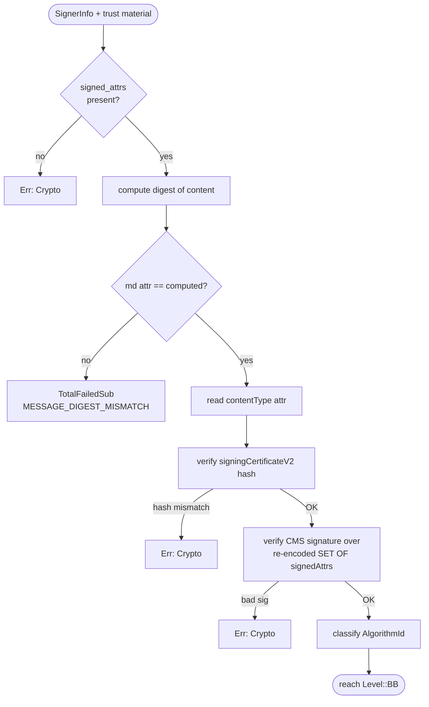
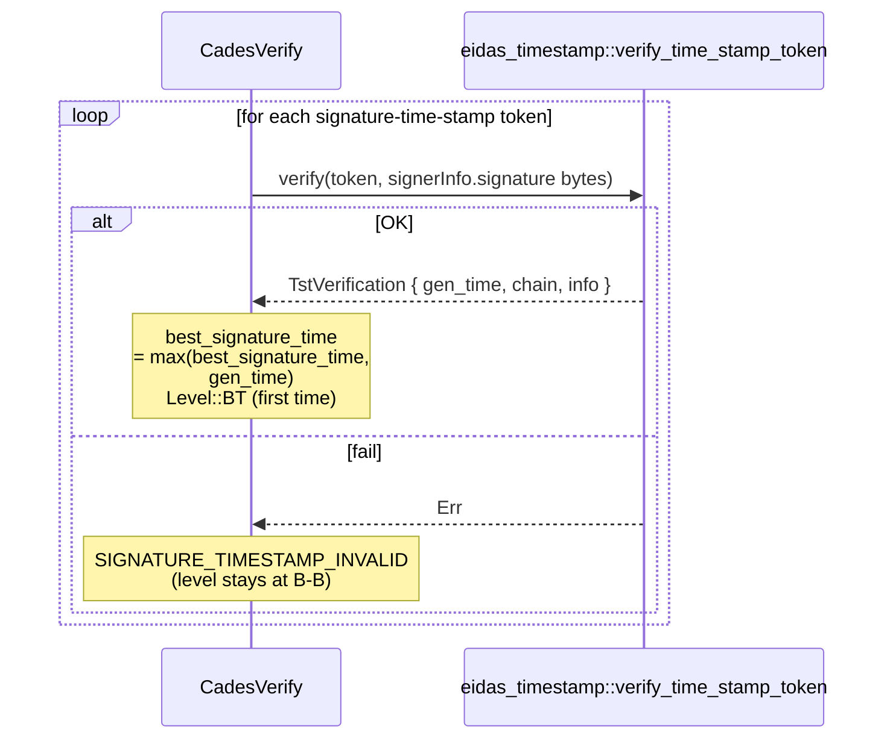
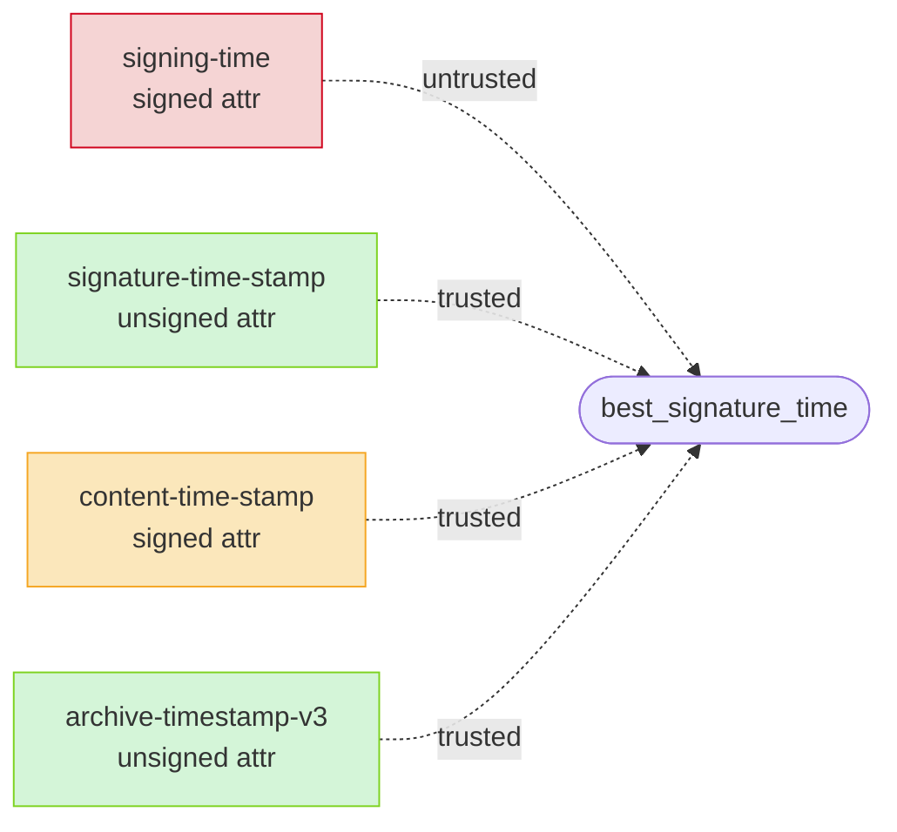
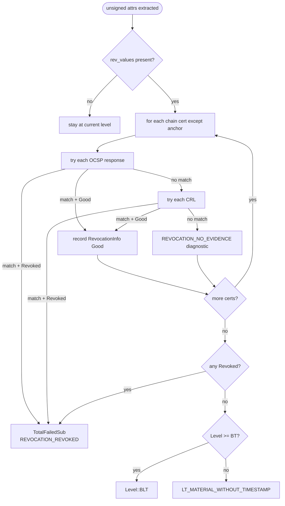
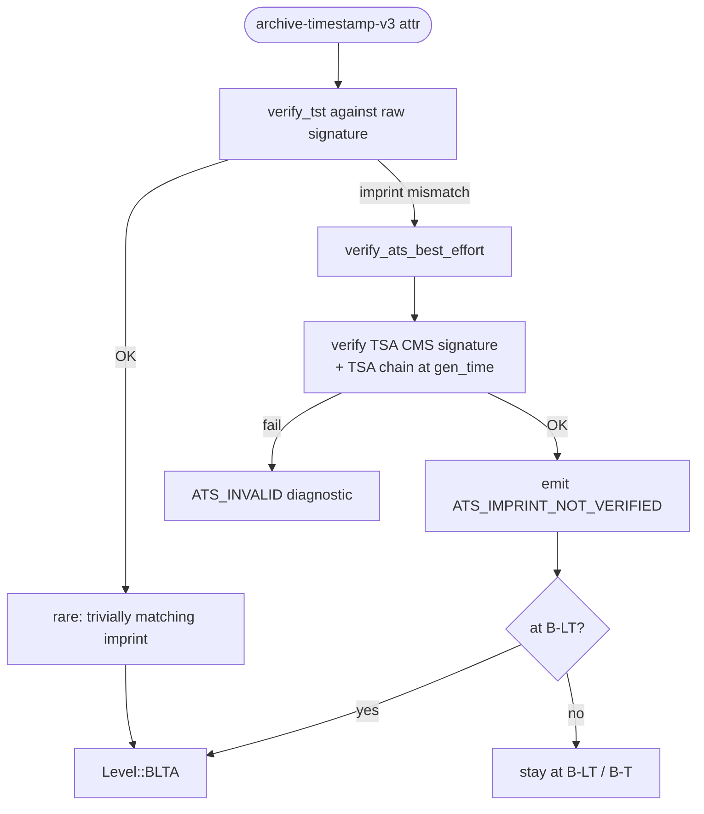

# Verification levels

ETSI AdES signatures come in four conformance levels: **B-B** (basic),
**B-T** (timestamped), **B-LT** (long-term), **B-LTA** (long-term with
archive). Each adds a layer of evidence on top of the previous one.

This document describes how `eidas-verify` climbs that ladder for a CAdES
signature. PAdES and ASiC inherit the same cascade by dispatching into
CAdES. JAdES and XAdES currently stop at B-B — see the overview doc for
the deferred level-lift work.

## The level ladder

```mermaid
stateDiagram-v2
    [*] --> Unknown

    Unknown --> BB: B-B checks pass
    BB --> BT: valid signature-time-stamp
    BT --> BLT: embedded revocation data<br/>covers every chain cert
    BLT --> BLTA: valid archive-timestamp-v3

    BB: Level::BB
    BB: messageDigest OK<br/>signingCertificateV2 OK<br/>CMS signature OK<br/>chain builds<br/>policy accepts
    BT: Level::BT
    BT: + adds best_signature_time
    BLT: Level::BLT
    BLT: + embedded revocation proofs
    BLTA: Level::BLTA
    BLTA: + archive-timestamp (imprint deferred)

    Unknown: Level::Unknown
    Unknown: any B-B check failed
```

Any downgrade (a revocation error at B-LT, an invalid TST at B-T) does
**not** cascade back — once the crypto-core passes, failing auxiliary
evidence is recorded in diagnostics and the level stays at whatever was
last reached. This mirrors EN 319 102-1's "indeterminate doesn't mean
invalid" philosophy.

## B-B — the mandatory core

Source: `crates/eidas-cades/src/verify.rs::run_bb_core`.



Key detail — **`signedAttrs` re-encoding**: RFC 5652 §5.4 says the bytes
the signer hashes are `signedAttrs` re-tagged as `SET OF Attribute`, not
the IMPLICIT `[0]` form that appears on the wire. `eidas_cms::attrs::to_signed_der`
handles that by calling `to_der()` on the `SetOfVec<Attribute>`, which
emits the universal `SET` tag `0x31`.

## B-T — the signature timestamp

After B-B passes, the CAdES orchestrator walks the
`id-aa-signatureTimeStampToken` unsigned attribute. Each token is a full
RFC 3161 TimeStampToken whose imprint covers `signerInfo.signature`
(i.e. the signature value itself, not the signed attributes).



### Best-signature-time cascade

`best_signature_time` — the latest trustworthy instant we believe the
signature existed at — drives subsequent evaluation. Its sources, in
ascending trust order:



Only timestamps that fully verify — TSA chain OK, imprint matches, TSA
cert has `id-kp-timeStamping` EKU — feed `best_signature_time`. The
`signing-time` signed attribute is surfaced as `signing_time_claimed`
for reporting but is never trusted for policy decisions.

When `ValidationTime::BestSignatureTime` is in play, `reference_time`
becomes `best_signature_time.unwrap_or_else(Utc::now)` so chain and
policy run against the historical instant.

## B-LT — embedded revocation

The `id-aa-ets-certValues` + `id-aa-ets-revocationValues` unsigned
attributes carry a self-contained bundle of certificates and CRL/OCSP
responses. Presence of both ≠ B-LT; they must actually prove
non-revocation of every non-anchor chain cert at the reference time.



Key implementation detail — **OCSP wrapping**:
`id-aa-ets-revocationValues.ocspVals` carries `BasicOcspResponse` DER,
not the outer `OcspResponse` wrapper. `eidas-cades::verify::wrap_basic_as_ocsp_response`
synthesises the envelope so the existing
`eidas_revocation::verify_ocsp` primitive can consume it unchanged.

## B-LTA — archive timestamps

`id-aa-ets-archiveTimestampV3` is a TST over canonicalised CAdES bytes
constructed per EN 319 122-1 §5.5.3. The canonicalisation algorithm is
non-trivial — it assembles a byte sequence from:

1. Selected DER-encoded `SignedData` fields,
2. Each `SignerInfo`'s `signature`,
3. Every preceding archive timestamp, in order,
4. `SignedData.certificates` and `crls` (if any).

Today `eidas-verify` parses and validates the TST's CMS structure and
the TSA's chain, but does **not** recompute the canonical imprint.



The `ATS_IMPRINT_NOT_VERIFIED` warning is the library's way of being
honest about a trust-boundary gap: the TSA's *signature* is trustworthy,
but we haven't cryptographically re-bound it to the signed data. A
security review should downgrade such reports.

## Level-aware `qualification`

The qualification engine ignores `level_reached` — it only looks at the
chain, the TSL service status, and the signer cert's `qcStatements`.
That keeps the two axes independent: a B-B signature to a qualified
certificate is `QES` the same way a B-LTA one is, provided it passes
the B-B crypto checks.

## Test vectors

Every level transition is covered by integration tests:

| Test | Level reached | File |
|------|---------------|------|
| `cades_bb_rsa_attached_round_trip` | B-B | `crates/eidas-cms/tests/cades_bb.rs` |
| `cades_bt_round_trip_lifts_level_to_bt` | B-T | `crates/eidas-cades/tests/cades_bt.rs` |
| `cades_bb_without_timestamp_stays_at_bb` | B-B | `crates/eidas-cades/tests/cades_bt.rs` |
| `cades_bt_invalid_timestamp_keeps_bb_with_warning` | B-B | `crates/eidas-cades/tests/cades_bt.rs` |
| `cades_blt_round_trip_lifts_level_to_blt` | B-LT | `crates/eidas-cades/tests/cades_lt.rs` |

B-LTA does not yet have a positive integration test — canonicalising
CAdES bytes to pass the ATS imprint check is the same problem the
verifier itself defers. A DSS-corpus-based test arrives alongside the
full ATS implementation.
