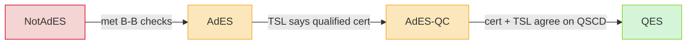
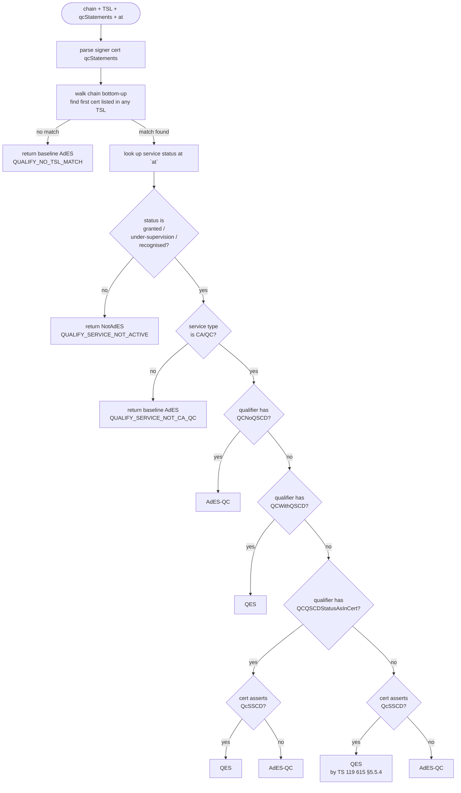
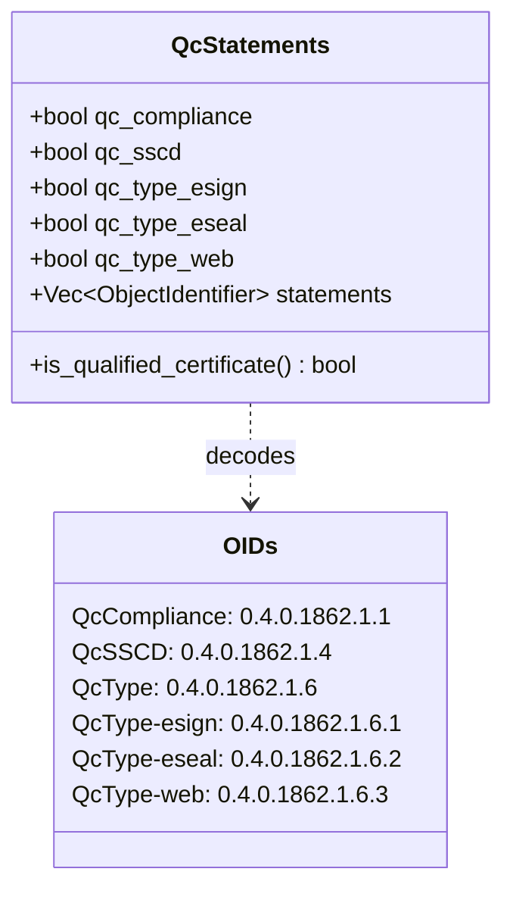
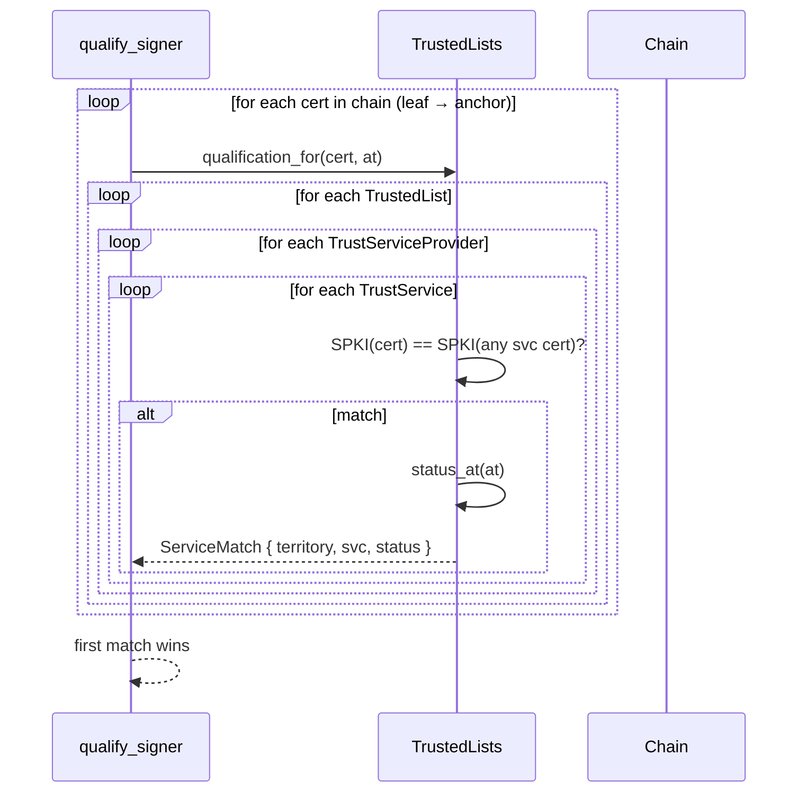

# Qualification (ETSI TS 119 615)

A *qualified* electronic signature (QES) under Article 3 of eIDAS has the
same legal weight as a handwritten signature across the EU. Getting there
requires more than cryptographic validity — the signer's certificate
must be issued by a qualified trust-service provider (QTSP) listed on an
EU member state's Trusted List, and the private key must sit on a
qualified signature-creation device (QSCD).

`eidas-qualify` implements that decision.

## The three qualification levels



| Level | Legal meaning |
|-------|---------------|
| `NotAdES` | Failed a mandatory check (e.g. TSL service withdrawn). |
| `AdES` | Advanced Electronic Signature — crypto-valid, chain builds, policy OK. |
| `AdESqc` | Advanced + issued under a qualified certificate (TSL CA/QC). |
| `QES` | Qualified — AdES-QC **and** backed by a QSCD. Article 3 weight. |

## The decision tree

Source: `crates/eidas-qualify/src/engine.rs::qualify_signer`.



### Why three "no-qualifier" paths?

TS 119 615 carefully distinguishes three TSL-side statements about QSCD:

- **`QCWithQSCD`** — TSL explicitly asserts QSCD. Trust the TSL.
- **`QCNoQSCD`** — TSL explicitly denies QSCD. Honour it even if the cert claims otherwise.
- **`QCQSCDStatusAsInCert`** — "believe the cert". Falls back to the cert's `id-etsi-qcs-QcSSCD` statement.
- *(no qualifier)* — §5.5.4 "when the TSL is silent, trust the cert".

These matter in practice because Member States publish TLs with slightly
different qualifier conventions, and the cert's `qcStatements` are
authoritative only when the TSL explicitly says so.

## `qcStatements` parsing

Source: `crates/eidas-qualify/src/qcstatements.rs`.

The X.509 `qcStatements` extension (OID `1.3.6.1.5.5.7.1.3`, RFC 3739 +
ETSI EN 319 412-5) carries a `SEQUENCE OF QCStatement`:

```text
QCStatement ::= SEQUENCE {
    statementId   OBJECT IDENTIFIER,
    statementInfo ANY DEFINED BY statementId OPTIONAL
}
```

We extract the following flags:



Only the *presence* of each statement OID is recorded; `QcLimitValue`,
`QcPDS`, and other value-bearing statements are walked past without
interpretation.

## TrustedList lookup

Source: `crates/eidas-trust/src/qualify.rs::qualification_for`.

Given a chain, the engine walks upward looking for a certificate that
matches a service entry in the supplied `TrustedLists`. Matching is by
**SubjectPublicKeyInfo byte-equality**, not full cert DER, so TSP
rekey/renewal events don't break the match:



Historical matches are included — if the signer's CA rotated out of the
current TSL cert list but still appears in a `ServiceHistoryInstance`, the
match succeeds there. Combined with `ValidationTime::BestSignatureTime`,
this makes the qualification engine correct for historical validation of
long-term signatures.

## Wiring into CAdES verification

`eidas-cades` invokes the qualification engine automatically when a
`TrustedLists` is attached, via the `ts-119-615` feature:

```rust
let trust = eidas_verify::cades::CadesTrustMaterial::new()
    .with_anchors([ca_cert])
    .with_trusted_lists(tls);

let report = eidas_verify::cades::verify_cades(&input, &trust, &policy, time)?;
// report.signatures[0].qualification reflects TS 119 615.
```

Without a TrustedList, every `SignatureReport.qualification` stops at
`Qualification::AdES`. With one, the engine's result replaces that
baseline. The per-signature wiring site is
`crates/eidas-cades/src/verify.rs::apply_qualification`.

## Scope limits

The engine implements the common paths of TS 119 615 §5. The following
are **deliberately unimplemented** and documented here for the next
hardening pass:

- **Mutual-recognition agreements** with non-EU territories (TS 119 615 §6).
- **Granted-at-date** qualifiers applied to historical service instances.
- **Cross-consistency checks** between TSL qualifiers and cert QCStatements
  that yield `IndeterminateSub` per §5.5.6 (contradictions currently
  produce `QUALIFY_QES_WITHOUT_QC_COMPLIANCE` as a warning only).
- **Supervision-status transitions** (e.g. `UNDER_SUPERVISION` recently
  became `WITHDRAWN`) — only the status at `at` is checked.
- **Multiple simultaneous matches** — first match wins; diagnostics do
  not flag when the chain hits more than one TSL service.

## Test coverage

Source: `crates/eidas-qualify/tests/qualify_tests.rs`.

Seven integration tests cover the decision matrix:

| Scenario | Expected |
|----------|----------|
| TSL `granted` + `QCWithQSCD` | `QES` |
| TSL `granted` + `QCNoQSCD` (even with cert QcSSCD) | `AdESqc` |
| TSL `granted` + `QCQSCDStatusAsInCert` + cert has QcSSCD | `QES` |
| TSL `granted` + `QCQSCDStatusAsInCert` + cert lacks QcSSCD | `AdESqc` |
| TSL `withdrawn` | `NotAdES` |
| Unlisted CA | baseline `AdES` |
| `QcStatements` parser | QcCompliance + QcSSCD detected |

Plus `crates/eidas-cades/tests/cades_qualify.rs` which runs the full
openssl-CMS → CAdES verify → qualification pipeline end-to-end.
