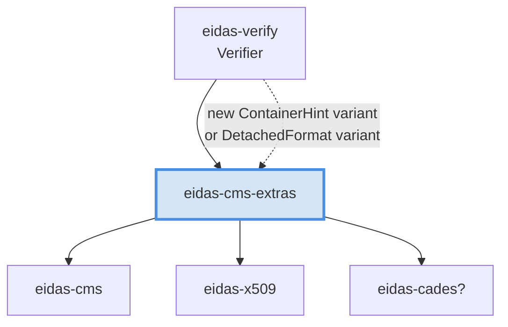

# Features and extension points

## Feature-flag reference

All flags live on the `eidas-verify` facade crate. Default set:

```toml
default = ["cades", "pades", "asic", "jades", "trust-list", "ts-119-615", "cades-qualify"]
```

### Flag-to-capability matrix

| Flag | Enables | Pulls in | Default? |
|------|---------|----------|----------|
| `cades` | CAdES B-B → B-LTA verification | `eidas-cms`, `eidas-cades` | ✓ |
| `pades` | PDF scanning + dispatch | `eidas-pades` (+ `cades`) | ✓ |
| `asic` | ASiC-S / ASiC-E ZIP dispatch | `eidas-asic` (+ `cades`) | ✓ |
| `jades` | JWS verification | `eidas-jades` | ✓ |
| `xades` | Narrow-profile XMLDSig | `eidas-xades` | ✗ opt-in |
| `trust-list` | TS 119 612 TSL parsing | `eidas-trust` | ✓ |
| `ts-119-615` | Qualification engine | `eidas-qualify` (+ `trust-list`) | ✓ |
| `cades-qualify` | Wire the qualification engine into CAdES reports | `eidas-cades/ts-119-615` | ✓ |

### Minimum-footprint builds

For a CAdES-only, no-qualification crate:

```toml
eidas-verify = { version = "0.1", default-features = false, features = ["cades"] }
```

This strips PAdES, ASiC, JAdES, TrustedList parsing, the qualification
engine — leaving just `eidas-cms` + `eidas-cades` + their primitives.

### What `xades` actually costs

`xades` is opt-in despite being pure-Rust because:

1. **Scope clarity.** The crate ships a narrow profile (exc-c14n only, no
   XPath, no DTDs). Callers who don't need XMLDSig shouldn't silently
   pull it in; the feature flag makes the scope boundary visible.
2. **Compile time.** `quick-xml` + the c14n module add ~3 s on a cold
   `cargo build`.
3. **Future swap.** The narrow profile is a stopgap. When the
   libxml2/xmlsec1 FFI backend lands, the `xades` feature flips to that
   implementation — keeping it opt-in means the C-dep decision doesn't
   leak into everyone's build.

## Extension points

### Custom algorithm policy

`AlgorithmPolicy` is owned by the caller. Start from the ETSI default
and tighten:

```rust
use eidas_verify::{policy, AlgorithmId, HashAlgorithm, SignatureAlgorithm};

let mut p = policy::etsi_119_312_2023();

// Forbid SHA-224 (not on current CSPN white-list).
p.forbid(
    AlgorithmId {
        signature: SignatureAlgorithm::RsaPkcs1v15,
        hash: HashAlgorithm::Sha224,
        key_bits: 2048,
    },
    "internal: SHA-224 not approved",
);

// Raise the minimum RSA key size above the ETSI default.
p.min_rsa_bits = 3072;

let verifier = Verifier::builder()
    .trust_anchors([anchor])
    .policy(p)
    .build()?;
```

Policies are plain `Clone` / `Debug` values — build them once and reuse.

### Caller-supplied revocation material

The facade handles CAdES-embedded revocation automatically. For
out-of-band revocation checks (e.g. you downloaded a fresh CRL five
minutes ago), use the `revocation` module directly:

```rust
use eidas_verify::revocation::{verify_crl, verify_ocsp};

let check = verify_crl(
    &crl_der,
    &issuer_cert,
    "CN=target",
    &target_serial,
    chrono::Utc::now(),
)?;
match check.info.status {
    eidas_verify::RevocationStatus::Good => { /* ok */ }
    eidas_verify::RevocationStatus::Revoked { at, reason } => { /* reject */ }
    eidas_verify::RevocationStatus::Unknown => { /* indeterminate */ }
}
```

The returned `RevocationInfo` has the same shape as the ones the CAdES
flow embeds in reports, so you can mix external revocation data with the
library's output by hand if your workflow requires it.

### Caller-supplied TrustedLists

`eidas-trust` owns the TSL parsing; `eidas-qualify` consumes the result.
Attach to `CadesTrustMaterial` via `with_trusted_lists`:

```rust
use eidas_verify::{cades::CadesTrustMaterial, trust};

let lotl = trust::parse_trusted_list(&lotl_xml_bytes)?;
let de_tl = trust::parse_trusted_list(&de_tl_xml_bytes)?;
let tls = trust::TrustedLists { lists: vec![lotl, de_tl] };

let trust = CadesTrustMaterial::new()
    .with_anchors([ca_cert])
    .with_trusted_lists(tls);
```

**The TSL's own XMLDSig is not verified.** This is a known gap — see
the security doc for the mitigation guidance.

### Historical validation

Pass `ValidationTime::At(instant)` or `ValidationTime::BestSignatureTime`
to evaluate a signature against a past moment. The engine will build the
chain, check revocation freshness, and evaluate algorithm policy at that
instant rather than at `Utc::now()`:

```rust
use chrono::{TimeZone, Utc};

let one_year_ago = Utc::now() - chrono::Duration::days(365);
let verifier = Verifier::builder()
    .trust_anchors([anchor])
    .validation_time(ValidationTime::At(one_year_ago))
    .build()?;
```

For long-term signatures, prefer `BestSignatureTime` — the library
extracts the latest trustworthy timestamp from the artefact itself.

### Bypassing the facade

Every sub-crate is re-exported as a module. Use them directly for:

- **Running multiple sub-steps without re-parsing** — e.g. parse CMS once
  via `eidas_cms::parse_cms_envelope`, then inspect `SignerInfo`s by hand.
- **Custom orchestration** — verify a CAdES signature, extract the
  signer, then run qualification against a different TSL set than the
  rest of your corpus.
- **Tooling and diagnostics** — pretty-print `TstInfo.gen_time`, dump
  `TrustService.qualifiers`, walk `QcStatements.statements`.

See `docs/04-types.md` for the full per-crate API surface.

## Adding a new signature format

The plan for a future format crate (say `eidas-cms-extras` for
S/MIME-style messages) looks like this:



Checklist:

1. New crate in `crates/`.
2. Workspace `Cargo.toml` — add to `members` and `workspace.dependencies`.
3. Depend on `eidas-core` (`SignatureReport`, `VerificationReport`,
   `Error`) and whichever primitives you need (`eidas-cms` for CMS
   parsing, `eidas-x509` for chains, `eidas-cades` for B-T/B-LT level lift).
4. Implement a top-level `verify_<format>(input, trust, policy, time) -> Result<VerificationReport>`.
5. Add a feature flag on `eidas-verify` — default-off unless you're
   confident it's safe to expand the default surface.
6. Add a `ContainerHint` or `DetachedFormat` variant.
7. Wire the dispatch in `crates/eidas-verify/src/verifier.rs::verify`.
8. Integration test under `tests/`.

The workspace layer graph is strict — don't create dependency cycles by
making `eidas-cms` depend on your new crate. Primitives point
downward; composition points upward.

## Adding a new algorithm

RustCrypto primitives are feature-gated per curve/hash. To add
SHA-3-256 support for example:

1. `eidas-core`'s `HashAlgorithm` already has `Sha3_256`; it just isn't
   dispatched.
2. Extend `eidas-cms::digest::digest` to delegate to `sha3::Sha3_256`.
3. Extend `eidas-cms::signature_verify::rsa_pkcs1v15_verify` matches on
   the hash OID.
4. If you're adding a new curve: add the crate as a workspace dep,
   extend the `ecdsa_dispatch` in `signature_verify.rs`.

Policy rejection of unsupported algorithms is automatic — if an
algorithm isn't classified, the CAdES classifier returns
`Error::Unsupported` and the signature reports `CADES_VERIFICATION_ERROR`.
