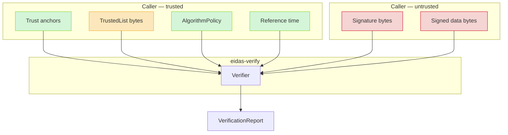
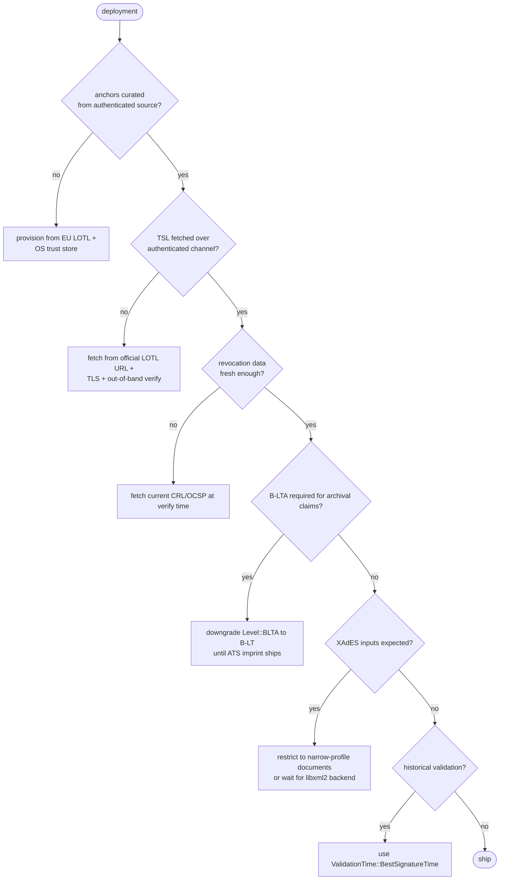

# Security model

This document describes the trust boundaries, guarantees, and known
gaps of `eidas-verify`. Read it before deploying.

## Trust boundaries

- **Trust anchors (green)** — the root of the system. Compromise here
  voids every signature. Callers are responsible for provisioning
  anchors from an authenticated source (EU LOTL, OS trust store curated
  to eIDAS-approved roots, pinned corporate CAs).
- **Algorithm policy + reference time (green)** — caller-controlled.
  `Utc::now()` is trusted; a custom policy is trusted.
- **TrustedList bytes (amber)** — trusted *for the structured content we
  parse*, but **the library does not verify the TSL's own XMLDSig
  signature** (see the TrustedList gap below). Callers must authenticate
  the TSL out-of-band.
- **Signature + data bytes (red)** — attacker-controlled. Every parser,
  every crypto check, every bounds check guards against malicious input.

## What the library guarantees

For a signature that returns `Status::TotalPassed`:

1. **Cryptographic signature verified** under a RustCrypto primitive
   (`rsa`, `ecdsa`/`p256`/`p384`) at the algorithm named in the
   signature.
2. **MessageDigest matches** — the signed content, byte-for-byte, is
   what the signature commits to (via the signed-attribute chain for
   CAdES; via the `Reference/DigestValue` for XAdES; via the signing
   input for JWS).
3. **Signer cert → anchor chain builds** through intermediates
   (embedded + caller-supplied) with:
   - name matching (AKI→SKI preferred, DN fallback),
   - validity window covers `reference_time`,
   - each intermediate is a CA (basicConstraints.cA = true) with
     `keyCertSign` where applicable.
4. **Algorithm policy accepts** the signature algorithm + hash + key
   size at `reference_time`.
5. **No revocation evidence shows revocation** — when revocation
   material is present (embedded LT, or caller-supplied), every
   non-anchor chain cert is either `Good` or flagged
   `REVOCATION_NO_EVIDENCE`. Any `Revoked` status downgrades to
   `TotalFailedSub`.
6. **When a timestamp lifted the level** — the TSA's chain built to an
   anchor and its `id-kp-timeStamping` EKU was present.
7. **When `Qualification == QES`** — a TSL service matched the chain by
   SPKI, its status was active at `reference_time`, it was a CA/QC
   service, and either:
   - the TSL carried a `QCWithQSCD` qualifier, or
   - the TSL + cert agreed on QSCD per TS 119 615 §5.5.4.

## What the library does not guarantee

### Offline revocation ≠ current revocation

The library only sees what you hand it. A signature with `Status::TotalPassed`
and `RevocationStatus::Good` means the revocation data you handed us
didn't list that cert as revoked. If that data is six months stale, the
cert may have been revoked for five of those months.

**Mitigation:** for signatures that matter *right now*, fetch a fresh
OCSP response or CRL and run `eidas_verify::revocation::verify_{ocsp, crl}`
at call time. For long-term signatures this is by design — the whole
point of B-LT is that the revocation evidence is frozen at the moment
the signature matured.

### TrustedList signatures are not verified

The library parses TS 119 612 TSL XML into structs but does **not** verify
the enveloped `<ds:Signature>` that accompanies it. An attacker who can
substitute the TSL bytes could insert a fake CA/QC service listing their
own root and have every signature under that root marked `QES`.

**Mitigations, in order of preference:**

1. **Fetch TSLs over authenticated transport from the official LOTL
   URLs** and rely on TLS + DNSSEC + the EU LOTL anchor chain. This is
   what EU DSS does.
2. **Verify the TSL signature with an out-of-band tool** (xmlsec1,
   OpenSSL + the LOTL signing certs) before parsing.
3. **Pin TSL hashes** on a schedule aligned to the 6-month LOTL
   refresh cycle.

The Phase 7 plan earmarked TSL signature verification for the same
libxml2/xmlsec1 backend that will power full XAdES support. Until that
lands, options 1-3 above are the only safe deployments.

### Archive-timestamp imprint is not recomputed

For B-LTA signatures, the library verifies the TSA's CMS signature and
the TSA's own X.509 chain, but does **not** recompute the canonical
imprint per EN 319 122-1 §5.5.3. The TSA's signature is trustworthy; the
binding of that signature to the specific CAdES payload is **not
cryptographically re-checked**.

Every B-LTA report carries an `ATS_IMPRINT_NOT_VERIFIED` warning so this
trust boundary is visible.

**Mitigation:** downgrade `Level::BLTA` to `Level::BLT` in downstream
business logic until this ships. Reports with the warning should never
be used to claim archival integrity guarantees.

### XAdES outside the narrow profile

The XAdES implementation handles enveloped signatures, Exclusive C14N 1.0,
no XPath/XSLT/DTD, and a limited algorithm set. Documents using
attribute-value namespace rewriting, whitespace-sensitive DTD defaults,
or ds:XPath filters are rejected with an explicit diagnostic rather than
silently mis-verified.

Every XAdES report carries an `XADES_NARROW_PROFILE` warning.

**Mitigation:** treat XAdES verification as advisory until the libxml2
backend lands. For documents known to be outside the narrow profile,
reject at the API boundary based on the diagnostic.

### JAdES B-T / B-LT / B-LTA

JAdES `sigTst`, `xRefs`/`rRefs`/`xVals`/`rVals`, and `arcTst` headers are
parsed but not yet rolled into the level cascade. A JAdES-T signature
reports as `Level::BB` with a `JADES_SIG_TST_NOT_VERIFIED` info
diagnostic.

**Mitigation:** for JAdES deployments requiring B-T proof, verify the
`sigTst` timestamp token manually via `eidas_verify::timestamp::verify_time_stamp_token`.

## Threat model

### In scope

| Threat | Defence |
|--------|---------|
| Tampered signed document | MessageDigest / Reference digest check |
| Forged signature | RustCrypto primitive verification |
| Expired signer cert, fresh signature | Chain validity window at `reference_time` |
| Algorithm downgrade (MD5, SHA-1, RSA-1024) | `AlgorithmPolicy::evaluate` |
| Revoked signer cert with embedded LT data | Revocation walk over `ets-revocationValues` |
| Malicious ASN.1 / XML / JSON input | `der`, `quick-xml`, `serde_json` hardened parsers; all parse errors return `Err` rather than panic |
| Path building around a missing intermediate | `ChainBuilder` requires full chain or fails |
| Unauthorised OCSP responder | `id-kp-OCSPSigning` EKU + issuer-delegation check |
| Unauthorised TSA | `id-kp-timeStamping` EKU enforced |
| Zero-length signatures / empty SignerInfos | Structural checks in each orchestrator |

### Out of scope

| Threat | Why |
|--------|-----|
| Rogue / malicious trust anchors | Caller controls anchors. |
| TSL substitution | See "TrustedList signatures are not verified" above. |
| Constant-time guarantees around secret material | Library is verify-only; no keys are held. |
| Side-channel attacks on the verifying host | No countermeasures; RustCrypto primitives are not always constant-time for verification. |
| DoS via enormous inputs | No explicit size limits; callers should bound input sizes. |
| Forged TSA returning a legitimate-looking token | Requires compromising the TSA's private key; outside our trust model. |

## Hardening checklist for production use

## Reporting security issues

See the repository's top-level `README.md` for the security contact.
Security-sensitive issues — particularly verification-bypass bugs, panic
vectors, or silent mis-classification — should go through private
disclosure before a public issue.

## Audit pointers

- **Parser surfaces** — audit first: `eidas-cms::envelope`,
  `eidas-pades::scan`, `eidas-asic::verify::collect_entries`,
  `eidas-jades::jws`, `eidas-xades::parse`,
  `eidas-trust::parse`. These are where attacker-controlled bytes
  first become Rust values.
- **Canonicalisation** — `eidas-xades::c14n` is deliberately narrow but
  still hand-written. Any discrepancy with the XMLDSig canonical form
  is a verification-bypass bug.
- **Policy evaluation** — `eidas-core::algorithm::AlgorithmPolicy::evaluate`
  has a fallback path; a new algorithm added without a specific rule
  falls into the generic minimum-strength check. Verify that path for
  novel algorithms.
- **Time handling** — `ValidationTime::BestSignatureTime` → chain
  rebuilds at a historical instant. Make sure your deployed
  reference-time source is monotonic if historical correctness matters.
