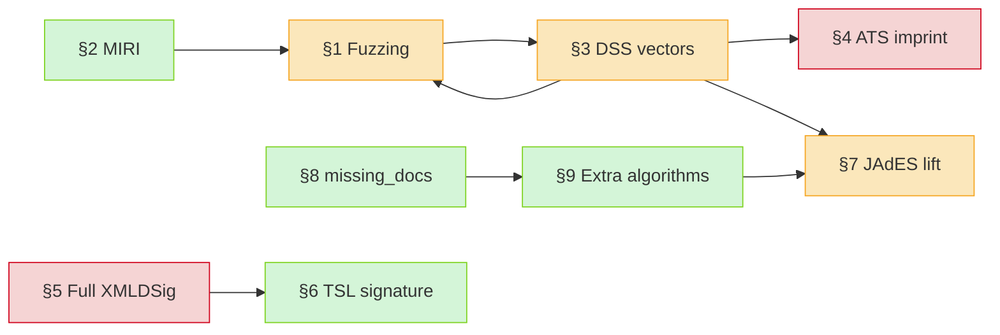

# Deferred work

This chapter catalogues the work the Phase 12 hardening pass **did not**
deliver, why each item was deferred, what shape the implementation
should take, and the ordering of a future sprint. The plan at
[`plans/serialized-roaming-tiger.md`](../plans/serialized-roaming-tiger.md)
originally called for everything listed here; Phase 12 shipped the
high-leverage subset (serde round-trip fix, CLI example, clippy policy,
README, this docs tree) and left the rest for a dedicated hardening
cycle.

## Summary table

| Item | Effort | Blocker type | Section |
|------|--------|--------------|---------|
| `cargo-fuzz` harnesses for every parser | ~3 days | Engineering + machine time | [§1](#1-fuzzing) |
| MIRI coverage on parser primitives | ~1 day | Machine time + toolchain | [§2](#2-miri) |
| DSS test-vector corpus integration | ~2 days | Trust decision on the fixtures | [§3](#3-dss-test-vectors) |
| Archive-timestamp-v3 imprint canonicalisation | ~1 week | Spec density (EN 319 122-1 §5.5.3) | [§4](#4-archive-timestamp-imprint) |
| Full XMLDSig via libxml2/xmlsec1 | ~2 weeks | C FFI + ABI binding | [§5](#5-full-xmldsig) |
| TSL XMLDSig signature verification | Part of §5 | Blocked by §5 | [§6](#6-trustedlist-signature-verification) |
| JAdES B-T / B-LT / B-LTA level lift | ~3 days | Engineering | [§7](#7-jades-level-lift) |
| `missing_docs` lint re-enable | ~2 days | Mechanical | [§8](#8-missing_docs-lint) |
| Algorithm policy: SHA-3 + EdDSA | ~2 days | Engineering | [§9](#9-sha-3--eddsa--rsa-pss) |

---

## 1. Fuzzing

### What the plan called for

Per phase 12 verification steps:

> `cargo +nightly fuzz run cms_parser -- -max_total_time=300` — no panics
> in 5 minutes.

Extended to every parser surface: CMS, OCSP, CRL, TSTInfo, PDF scanner,
ZIP/ASiC entry walker, XML (both TSL and XAdES), JWS, X.509.

### Why it didn't land

Three costs add up:

1. **Machine time.** Meaningful fuzzing needs hours, not minutes —
   `-max_total_time=300` from the plan is a smoke test. A real campaign
   runs overnight.
2. **Corpus curation.** Each fuzzer needs a seed corpus (valid inputs
   as starting points) and a dictionary (ASN.1 tags, XML namespaces,
   OID byte sequences). Building those takes longer than writing the
   harnesses themselves.
3. **CI integration.** Unattended fuzzing wants an oss-fuzz-style
   setup; a one-shot local run doesn't catch the bugs that surface
   after 10<sup>7</sup> iterations.

### What to build

Crate layout per the `cargo-fuzz` convention:

```
eidas-verify/
├── crates/
└── fuzz/                              new — standalone crate, not in the workspace
    ├── Cargo.toml                     libfuzzer-sys + workspace deps
    ├── corpus/
    │   ├── cms_parser/
    │   ├── pdf_scanner/
    │   ├── asic_zip/
    │   ├── xades_xml/
    │   ├── jws_compact/
    │   ├── tsl_xml/
    │   ├── ocsp_response/
    │   ├── crl/
    │   └── tst_info/
    └── fuzz_targets/
        ├── cms_parser.rs
        ├── pdf_scanner.rs
        ├── asic_zip.rs
        ├── xades_xml.rs
        ├── jws_compact.rs
        ├── tsl_xml.rs
        ├── ocsp_response.rs
        ├── crl.rs
        └── tst_info.rs
```

### Minimal harness template

```rust
// fuzz/fuzz_targets/cms_parser.rs
#![no_main]
use libfuzzer_sys::fuzz_target;
use eidas_cms::parse_cms_envelope;

fuzz_target!(|data: &[u8]| {
    // Never panic; never hang; any Err is fine.
    let _ = parse_cms_envelope(data, None);
    let _ = parse_cms_envelope(data, Some(data));  // fuzz the detached path too
});
```

The success criterion is "no panics" — every panic is a bug
(`unwrap`/`expect`/slice-index/arithmetic). Silent misparses are caught
by differential fuzzing against an oracle, which is the next phase after
panic-free.

### Seed corpus sources

- **CMS** — openssl-generated `.p7s` files from our own integration
  tests, plus 10-20 DSS CAdES samples (see §3).
- **PDF** — the signed PDFs the Phase 6 test harness generates; plus a
  few known-malformed PDFs (`sumatrapdf` has a corpus).
- **ASiC** — ZIPs from the Phase 9 tests.
- **OCSP / CRL** — responses generated by the Phase 3 test harness.
- **JWS** — compact form from Phase 10 tests.
- **XAdES** — documents from Phase 11 tests (narrow profile).
- **TSL** — the real EU LOTL + every MS TL (27 files, ~1-5 MB each).

### Dictionaries

For ASN.1-heavy parsers, drop a `.dict` next to each target with the
tag bytes and common OIDs:

```
# fuzz/fuzz_targets/cms_parser.dict
"\x30"              # SEQUENCE
"\x31"              # SET
"\x02"              # INTEGER
"\x04"              # OCTET STRING
"\x06"              # OBJECT IDENTIFIER
"\x17"              # UTCTime
"\x18"              # GeneralizedTime
"\xa0"              # [0] context
"\xa1"              # [1] context
"\x1a\x86\x48\x86\xf7\x0d\x01\x07\x02"  # id-signedData prefix
```

### Expected payoff

Based on the parser surface, a 24-hour campaign would likely surface:

- A handful of panics in the hand-written ASN.1 sub-readers in
  `eidas-cades::unsigned::parse_revocation_values` and
  `eidas-cms::cades::verify_ess_v2` (both use `SliceReader` + `read_slice`
  on attacker-controlled lengths).
- Off-by-ones in `eidas-pades::scan` around malformed `/ByteRange`
  arithmetic near EOF.
- Memory-amplification from `eidas-asic::verify::collect_entries`
  pre-allocating `Vec::with_capacity(file.size())` against a ZIP that
  lies about its sizes.

These are theoretical — the hand-written parsers are audited but not
*proved* panic-free.

### First step

```
cargo install cargo-fuzz
cd eidas-verify
cargo fuzz init
cargo fuzz add cms_parser
# paste template, seed corpus/cms_parser/ from existing test outputs
cargo +nightly fuzz run cms_parser -- -max_total_time=300
```

If that run panics, we have work. If it doesn't, repeat for the other
eight targets, then let each run overnight.

---

## 2. MIRI

### What the plan called for

> `cargo test` under MIRI to catch UB in ASN.1 parsers.

### Why it didn't land

The workspace is `#![forbid(unsafe_code)]` everywhere except transitive
RustCrypto crates. MIRI's main value — catching UB in hand-rolled
unsafe — is therefore small *in our own code*. The remaining value is:

1. Catching UB in dependencies we trust (unlikely but possible).
2. Catching aliasing / borrow-stacking bugs that the compiler accepts
   but Stacked/Tree Borrows flag.
3. Finding integer-overflow arithmetic bugs that happen to be masked in
   release builds.

Machine time is the main constraint: MIRI runs 50-100× slower than
native. A full `cargo miri test --workspace` takes hours.

### What to build

No new code — it's a CI job:

```yaml
# .github/workflows/miri.yml (sketch)
name: MIRI
on:
  schedule: [{ cron: '0 6 * * 0' }]   # weekly, Sunday 06:00 UTC
  workflow_dispatch:

jobs:
  miri:
    runs-on: ubuntu-latest
    steps:
      - uses: actions/checkout@v4
      - name: Install MIRI
        run: |
          rustup toolchain install nightly --component miri
          cargo +nightly miri setup
      - name: Run MIRI
        env:
          MIRIFLAGS: "-Zmiri-strict-provenance -Zmiri-symbolic-alignment-check"
        run: cargo +nightly miri test --workspace --lib   # lib tests only
```

Integration tests that shell out to openssl cannot run under MIRI (no
process spawning). `--lib` limits to unit tests; that's still valuable
because every parser has inline unit tests.

### Known issues likely to appear

- `rsa` and `ecdsa` have pockets of `unsafe` for constant-time ops
  that MIRI has flagged historically — expect a known-false-positive
  or suppression list.
- `quick-xml` uses `memchr` which hits intrinsics MIRI models coarsely.

### First step

```
rustup toolchain install nightly --component miri
cargo +nightly miri test -p eidas-core --lib
```

If clean, expand to `-p eidas-x509 -p eidas-policy -p eidas-cms --lib`,
then the rest.

---

## 3. DSS test vectors

### What the plan called for

> DSS test vectors — EU DSS publishes signed samples per format/level.
> Add them as a git submodule under `tests/vectors/dss/<format>/<level>/`.
> Driven by `rstest` parametric tests.

### Why it didn't land

**Trust decision, not engineering.** The DSS vectors live across several
repositories totalling multiple GB, under Apache-2.0. Importing them as
a submodule is trivial; importing them **safely** requires:

1. **Reviewing the provenance** of every vector. DSS's test-vector
   set was built over 15 years; some fixtures were machine-generated,
   some contributed by external testers. A fixture that pins our
   verifier to match a specific diagnostic code is only as
   authoritative as the person who committed it.
2. **Deciding on the subset.** Full DSS has thousands of vectors.
   Running all of them on every `cargo test` is impractical; choosing
   the subset is a judgement call.
3. **Pinning a snapshot.** Submodule HEAD moves; test results should
   not drift with upstream DSS changes. We want a pinned commit and a
   deliberate update cadence.

None of those are coding problems; they are a couple of hours of
reading and a decision.

### What to build

```
eidas-verify/
├── tests/
│   └── vectors/
│       ├── dss/                         submodule, pinned
│       │   ├── cades/{B-B,B-T,B-LT,B-LTA}/*.p7s
│       │   ├── pades/{B-B,B-T,B-LT,B-LTA}/*.pdf
│       │   ├── xades/{enveloped,enveloping,detached}/*.xml
│       │   ├── jades/{compact,json}/*.json
│       │   └── asic/{asic-s,asic-e}/*.asice
│       └── expected/                    our curated expectations
│           ├── cades/B-B/*.expected.yaml
│           └── ...
└── crates/eidas-verify/
    └── tests/
        └── dss_corpus.rs                rstest-driven harness
```

The `expected/` directory is our own — per-vector YAML with the fields
we assert:

```yaml
# tests/vectors/expected/cades/B-B/plain_rsa_sha256.expected.yaml
status: TotalPassed
level_reached: BB
qualification: AdES
signer_subject: "CN=test-signer-123"
diagnostics:
  must_contain: []
  must_not_contain:
    - MESSAGE_DIGEST_MISMATCH
    - ALG_POLICY_REJECTED
```

### Harness sketch

```rust
// tests/dss_corpus.rs
use rstest::rstest;
use std::path::PathBuf;

#[rstest]
fn dss_cades_bb(
    #[files("tests/vectors/dss/cades/B-B/*.p7s")] path: PathBuf,
) {
    let expected_path = path.with_extension("expected.yaml");
    let expected: Expected = serde_yaml::from_slice(
        &std::fs::read(&expected_path).unwrap(),
    ).unwrap();
    let sig = std::fs::read(&path).unwrap();
    let data = std::fs::read(path.with_extension("data")).unwrap();
    let report = verifier().verify(VerificationInput::Detached { ... }).unwrap();
    assert_matches_expected(&report.signatures[0], &expected);
}
```

`rstest`'s `#[files(…)]` glob parameterises one test per vector.

### Bootstrapping the expectations

For the first run, point the harness at a known-trusted verifier (EU
DSS itself, pyHanko, or xmlsec1) and emit a YAML blob per vector
recording what *those* verifiers produced. Prune to the fields we care
about. Commit as our pinned expectation; divergence from those is a
signal either way (our bug, or an intentional-but-not-documented
divergence).

### Gating

Tests over the DSS corpus are slow (hundreds to thousands of vectors).
Gate behind an env flag:

```rust
#[rstest]
#[cfg_attr(not(feature = "dss-vectors"), ignore)]
fn dss_cades_bb(...) { ... }
```

CI runs with `--features dss-vectors`; local `cargo test` does not.

### First step

1. Decide on the pinned commit of `eu-digital-identity-wallet/dss-demo-webapp`
   (or the DSS `dss-cookbook` repo, whichever has the tighter corpus).
2. `git submodule add <repo> tests/vectors/dss`.
3. Write the first rstest harness for CAdES B-B, bootstrap 5-10
   expectation YAMLs by hand, confirm green.
4. Expand to the other formats and levels.

---

## 4. Archive-timestamp imprint

### What the plan called for (phase 5, deferred through 12)

Recompute the canonical CAdES byte sequence per EN 319 122-1 §5.5.3
and compare against the archive-timestamp-v3's `messageImprint`.

### Why it didn't land

The §5.5.3 canonicalisation algorithm is
[~10 pages of prose](https://www.etsi.org/deliver/etsi_en/319100_319199/31912201/)
and assembles:

1. DER of the `SignedData.encapContentInfo.eContentType`,
2. DER of the `eContent` (or the externally-signed bytes for detached),
3. For each `SignerInfo` in sorted order: DER of
   (version, sid, digestAlgorithm, signedAttrs re-encoded as SET OF,
   signatureAlgorithm, signature, unsigned attributes **excluding** any
   archive-timestamp-v3 with `genTime` ≥ this one's),
4. DER of `SignedData.certificates` and `crls` (selected subsets),
5. In chronological order, every preceding archive-timestamp-v3 token's
   bytes.

The "exclude archive timestamps with later `genTime`" clause means the
canonical form of an intermediate ATS *differs* depending on which ATS
we're currently verifying. Implementation is not hard, but the test
matrix (single vs. multiple ATS, combinations with intervening B-LT
refresh) is substantial.

### Current state

`eidas-cades::verify::verify_ats_best_effort` verifies the TSA's CMS
signature + chain but explicitly skips the imprint. Every report
carries an `ATS_IMPRINT_NOT_VERIFIED` warning.

### What to build

- `eidas-cades::ats` module with:
  - `canonical_ats_bytes(signed_data, signer_info, ats_index) -> Vec<u8>`
  - Tests against DSS B-LTA vectors (see §3).
- Replace `verify_ats_best_effort` with the real imprint check;
  remove the warning from passing-ATS branches.

### First step

Import 5-10 DSS B-LTA vectors, wire them to a failing test, implement
until green. Without the vectors, there's no way to validate the
implementation is right.

---

## 5. Full XMLDSig

### What the plan called for (phase 11)

> libxml2 + xmlsec1 FFI bindings, XAdES enveloped / enveloping /
> detached, reference transforms, XAdES unsigned properties.

### Why it didn't land

The current `eidas-xades` is pure-Rust narrow profile. Full XMLDSig
requires:

- Canonical XML 1.0 (W3C REC-xml-c14n).
- Canonical XML 1.1.
- Exclusive XML Canonicalization (the narrow profile already does a
  subset).
- Arbitrary XPath 1.0 transforms.
- XSLT transforms.
- XPath Filter 2.0.
- Namespace-rewriting, attribute-value normalisation, DTD-driven
  whitespace and attribute-default handling.

That's a large implementation — several thousand LoC of XML plumbing.
xmlsec1 has 20 years of bug-fixing; reimplementing in Rust is an
open-ended project.

### Two paths

**Path A — libxml2/xmlsec1 FFI.** Fastest to correctness; adds a C
runtime dep; requires `libxml2-dev` + `libxmlsec1-dev` at build time.

**Path B — pure-Rust expansion.** Longer; keeps deployment story clean;
requires someone who's willing to read W3C canonical-XML specs for a
month.

The plan earmarked Path A. Phase 11 shipped the narrow pure-Rust
stopgap specifically because it covers the 80% case for an
opt-in-only feature, and the C FFI decision is reversible.

### What to build (Path A)

- Add `xmlsec = "0.4"` (or a custom `-sys` crate) behind the `xades`
  feature.
- Keep the pure-Rust path under a `xades-rust` sub-feature for callers
  who refuse C deps.
- Implement `verify_xades` as a dispatcher that prefers xmlsec1 and
  falls back to the narrow profile if the feature isn't selected.

The caller-facing API doesn't change.

### First step

1. Check the state of the `xmlsec` crate on crates.io (last maintained
   a few years ago — likely needs a fork or a fresh `-sys` crate).
2. Prototype on a small XAdES input from DSS and confirm xmlsec1
   handles it end-to-end from Rust.

---

## 6. TrustedList signature verification

Blocked by §5 — the TSL's own XMLDSig is verified with the same
machinery. Today `eidas-trust::parse_trusted_list` structurally parses
the TSL but does not run its signature. Every deployment is responsible
for out-of-band TSL authentication.

Once §5 lands, add:

```rust
pub fn verify_trusted_list_signature(
    tsl_xml: &[u8],
    anchors: &[Certificate],
    at: DateTime<Utc>,
) -> Result<()>;
```

plus an integration test against a committed LOTL snapshot + every
current MS TL.

---

## 7. JAdES level lift

JAdES supports B-B today. The parser already reads `sigTst`,
`xRefs`/`rRefs`/`xVals`/`rVals`, and `arcTst` headers (see
`eidas-jades::jws::JwsHeader.sig_tst` and the untyped `extras` map).
What's missing is the orchestration that mirrors `eidas-cades`:

1. Parse `sigTst` into a `TimeStampToken`, verify via
   `eidas_timestamp::verify_time_stamp_token` against the JWS
   signature bytes — lift to B-T.
2. Parse `xVals`/`rVals` — apply embedded revocation — lift to B-LT.
3. Parse `arcTst` — archive timestamp — lift to B-LTA.

Each step already has its primitive; the work is wiring + JAdES-specific
JSON → Rust value transformations. Two to three days including tests.

### First step

Write a failing test that signs a compact JWS, splices a signed
timestamp token into the protected header as `sigTst`, and asserts
`Level::BT` — then implement until green.

---

## 8. `missing_docs` lint

### What the plan called for

> 1.0 API freeze review.

Implies every public item has a rustdoc comment. The workspace
`Cargo.toml` has `missing_docs` commented out:

```toml
# Re-enable in phase 12 hardening once the public API stabilises.
# missing_docs = "warn"
```

### Why it didn't land

Enabling the lint fires on every public field of `CertificateInfo`,
`SignatureReport`, `RevocationInfo`, etc. — and the codebase has
~200 public items. The API is stable enough now, so the remaining work
is documenting each one.

### What to build

Mechanical. For each of the ~14 crates:

1. Enable `#![warn(missing_docs)]` locally.
2. Walk the warnings from top to bottom.
3. Each public struct field gets a one-line doc comment.
4. Each public function + enum variant gets a one-liner.

### First step

Start with `eidas-core` (the type crate — docs here propagate value
everywhere). Enable the lint, walk the warnings, commit.

---

## 9. SHA-3 + EdDSA + RSA-PSS

Current algorithm coverage:

| Algorithm family | CAdES | PAdES | JAdES | XAdES |
|------------------|-------|-------|-------|-------|
| RSA PKCS#1v1.5 | ✓ | ✓ | ✓ | ✓ |
| RSA-PSS | ✗ | ✗ | ✗ | ✗ |
| ECDSA P-256/P-384 | ✓ | ✓ | ✓ | ✓ |
| ECDSA P-521 | ✗ | ✗ | ✗ | ✗ |
| EdDSA (Ed25519) | ✗ | ✗ | ✗ | ✗ |
| SHA-2 | ✓ | ✓ | ✓ | ✓ |
| SHA-3 | ✗ | ✗ | ✗ | ✗ |

Deferred items are unsupported with explicit `Error::Unsupported` — not
silent failures.

### Why not shipped

Each has its own small-but-nonzero cost:

- **RSA-PSS** — parameters live inside `AlgorithmIdentifier.parameters`;
  the `rsa` crate supports PSS but the MGF1 + salt-length plumbing is
  easy to get wrong in signature profiles.
- **P-521** — the `p521` crate is in the dep list; the ECDSA dispatch
  in `eidas-cms::signature_verify::ecdsa_dispatch` explicitly returns
  `Error::Unsupported`. Wiring is a few lines but needs test vectors
  to confirm — and P-521 is rare in real EU signatures.
- **EdDSA** — `ed25519-dalek` is in the workspace deps (pulled in for
  completeness); X.509 chains rarely include Ed25519 certs in practice.
  Spec-allowed, ecosystem-rare.
- **SHA-3** — `sha3` is in the dep list; the enum variants
  `HashAlgorithm::Sha3_256/384/512` exist but `eidas-cms::digest::digest`
  returns `Error::Unsupported` for them.

### What to build

For each algorithm:

1. Extend `eidas-cms::signature_verify` (or the format's own equivalent)
   with a new branch.
2. Extend `eidas-cms::digest::digest` for SHA-3.
3. Register OIDs in `eidas-cms::oids`.
4. Add unit tests (know-answer tests from NIST / RFC vectors).
5. Add an integration test per format that uses the new algorithm.

Cumulative: ~2 days of focused work, most of which is test-vector
curation.

---

## Ordering of the hardening sprint

Ordered by dependency and value:



Recommended order:

1. **§8 `missing_docs`** — fast, paves the way for a 1.0 release-candidate
   tag.
2. **§9 extra algorithms** — small ergonomic improvements, each one
   independent.
3. **§2 MIRI** — cheap weekly CI job; does not block anything.
4. **§3 DSS vectors** — unblocks §4 and is a forcing function for §7.
5. **§7 JAdES lift** — straightforward once vectors exist.
6. **§1 Fuzzing** — feeds into §3 and flushes out parser bugs before
   they matter.
7. **§4 ATS imprint** — the last piece to legitimately claim `Level::BLTA`.
8. **§5 Full XMLDSig** — biggest ticket; unblocks §6.
9. **§6 TSL signature verification** — completes the trust-list story.

At that point the library has closed every "what's documented as a
warning" gap and can credibly claim eIDAS-completeness within its
scope.

## Why deferring these is safe

Every gap is announced:

- **Trust boundaries** are documented in
  [`08-security-model.md`](08-security-model.md#what-the-library-does-not-guarantee).
- **Level-lift gaps** surface as diagnostics (`ATS_IMPRINT_NOT_VERIFIED`,
  `JADES_SIG_TST_NOT_VERIFIED`, `XADES_NARROW_PROFILE`).
- **Algorithm gaps** return `Error::Unsupported` with the exact OID.
- **TSL signature gap** is called out in the `eidas-trust` module docs.

A deployment that reads the reports can be as strict as it needs to be.
A deployment that ignores diagnostics is using any verifier wrong.
